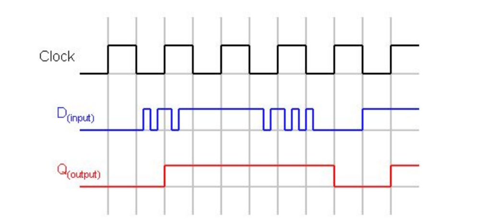
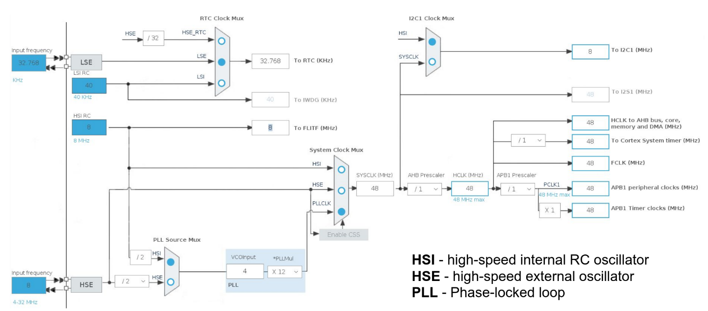
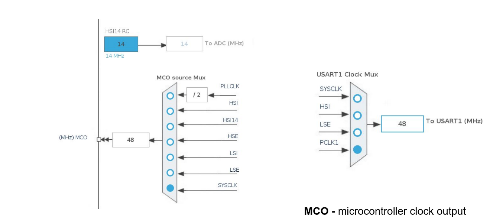

# Система Тактирования

## Тактовый сигнал

Тактовый сигнал - набор прямоугольных импульсов, необходим для синхронизации всех модулей микроконтроллера.

------------------------

## Основная схема тактирования

- HSE - подключения внешнего источника тактирования(кварц).
- PLL Source Mux - первый селектор, выбирает между внутренним и внешним тактированием.
- PLL - блок умножителей частоты.
- System Clock Mux - второй селектор.
- SYSCLK - шина системного тактирования.
- AHB prescaler - предделитель
- Enable CSS - переключатель между внутренним и внешним тактированием.

------------------------

## Часть системы тактирования, связанная с аналого-цифровым преобразователем(ADC)

- Слева - модуль генерации сигнала тактирования наружу.

## Инициализация системы тактирования

- Flash память работает на частоте, меньшей частоты системы. Поэтому
  `LL_FLASH_SetLatency(LL_FLASH_LATENCY_0)` при частоте < 24 МГц и 
  `LL_FLASH_SetLatency(LL_FLASH_LATENCY_1)` при частоте > 24 МГц
