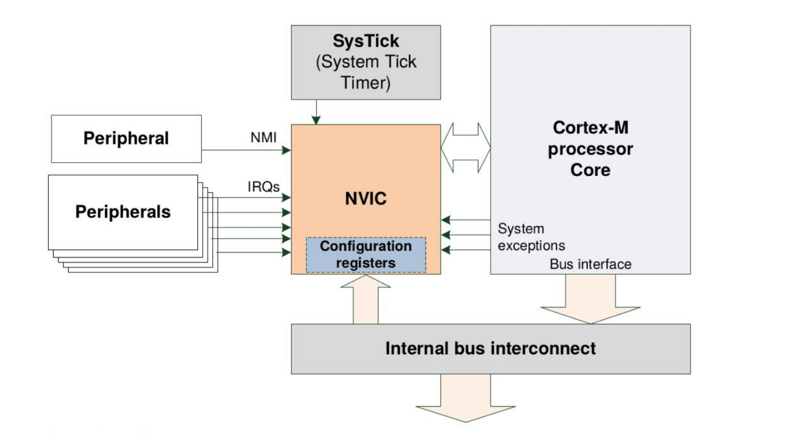
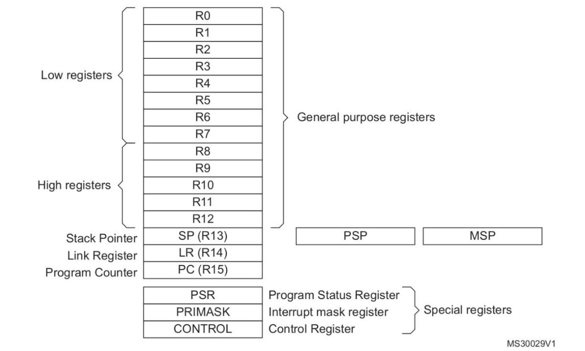
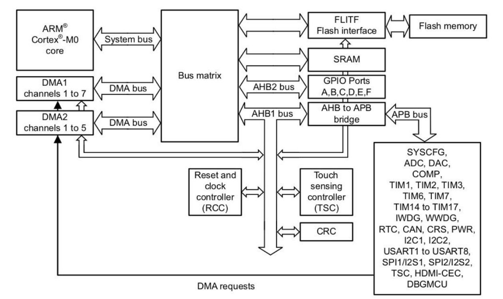
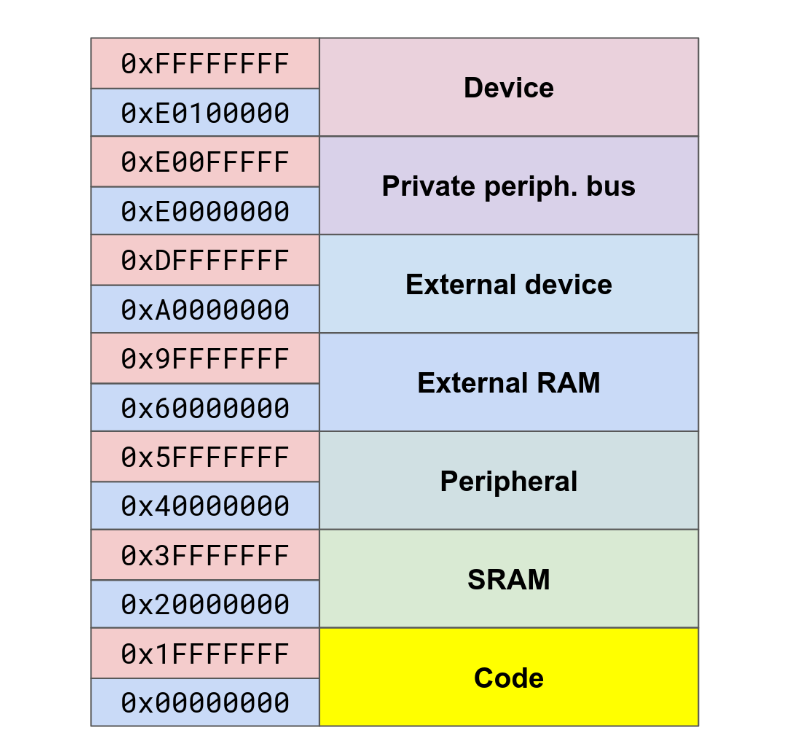

# Заметки

## Устройство Ядра

- Processor - обрабатывает инструкции.

- NVIC - контроллер прерываний. Принимает прерывания из периферии, останавливает работу процессора, совершает ответные действия.

- SysTick - системный таймер. Отсчитывает промежутки времени и уведомляет о них процессор.
- Internal bus - внутренняя шина.

--------------------------------

### Регистры

- Low registers - доступны почти всем командам.
- Hight registers - доступны лимитированным командам. 
- Link register - адресс возврата при вызове функции

--------------------------------

## Устройство микроконтроллера

- Flash memory - то, где хранится программа
- SRAM - оперативка
- GPIO - порты ввода\вывода общего пользования
- ADC - преобразует входной аналоговый сигнал в набор чисел, отображающих амплитуду сигнала.
- TIMN - таймеры
- RCC - модуль тактирования
- DMA - модуль прямого доступа к памяти. Разгружает процессор.

--------------------------------

## Структура памяти

- Обращение к определённому адресу микроконтроллер перенаправляет на соответствующий модуль.
- External RAM и External device недоступны на нашем микроконтроллере.

