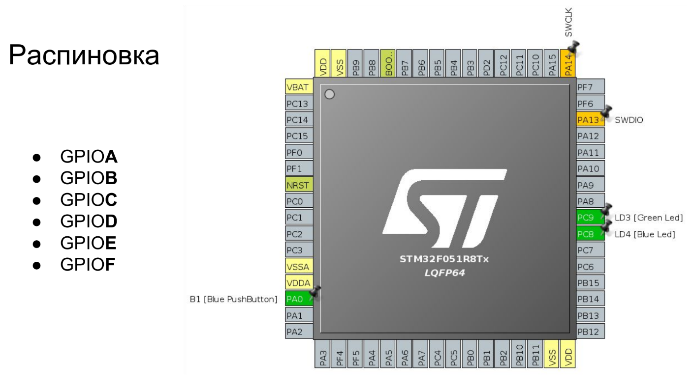
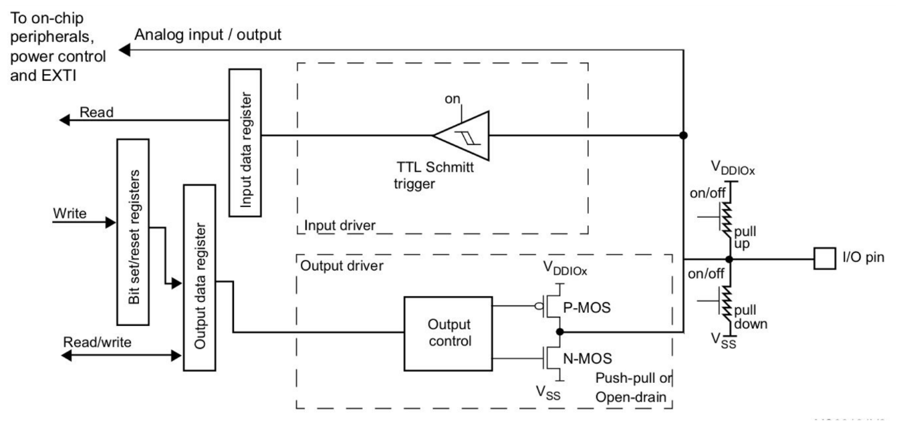

# Порты ввода вывода

- Слева - различные порты.
- У каждого порта максимум 16 пинов.
- PA13/PA14 - пины для соединения с программатором.
- PC8/PC9 - Leds

## Цифровой выход

  - PUSH-PULL
  - OPEN-DRAIN